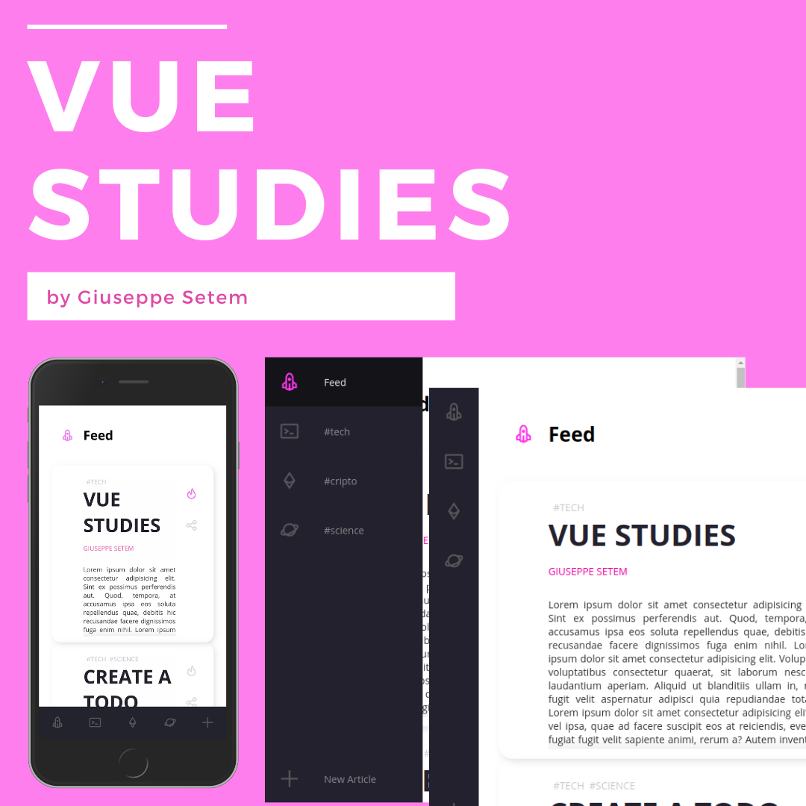

# Vue Studies

Learning new Vue skills! 🔥️



## Getting Started

This repo contains a Vue project with an UI inspired in the [fireship](https://www.youtube.com/watch?v=biOMz4puGt8) flexbox tutorial.

### Install & Run

Clone this repo!

```
git clone <repo>
cd <repo>
```

To **Install** this project, run inside the _repo_:

```
yarn install
```

To **Run** this project, execute:

```
yarn serve
```

## Features

- [x] Components
- [x] Flexbox (CSS3)
- [x] State
- [x] Lifecycles
- [x] Services
- [ ] Routes
- [ ] Vuex
- [ ] Testing

## Build With

- @vue/cli 4.2.3
